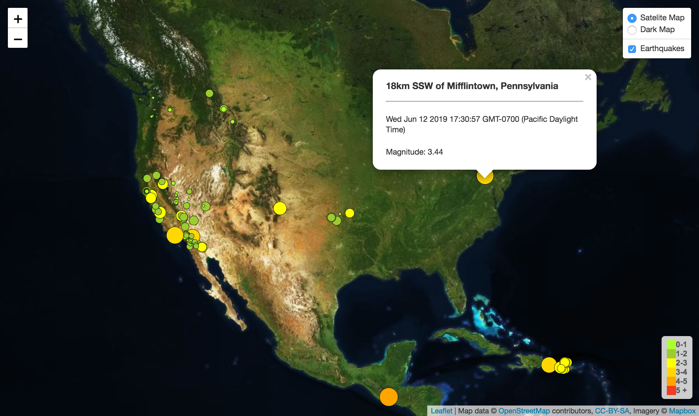
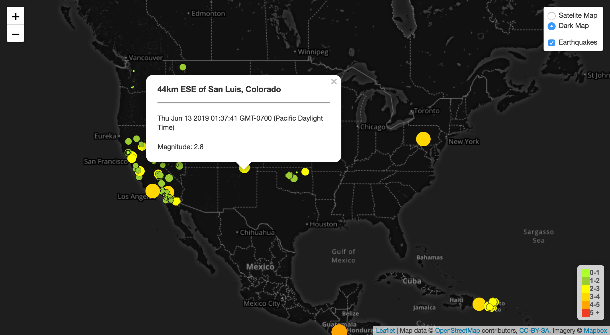

# Visualizing-Earthquake-Data-with-Leaflet
## Get Data
The USGS provides earthquake data in a number of different formats, updated every 5 minutes. Visit the USGS GeoJSON Feed (https://earthquake.usgs.gov/earthquakes/feed/v1.0/geojson.php) page and pick a 'All Earthquakes from the Past 7 Days' data set to visualize. I used the URL of this JSON to pull in the data for the visualization.

## Import & Visualize the Data
* Create a map using Leaflet that plots all of the earthquakes from the data set based on their longitude and latitude.

* Make data markers that reflect the magnitude of the earthquake in their size and color. Earthquakes with higher magnitudes should appear larger and darker in color.

* Include popups that provide additional information about the earthquake when a marker is clicked.

* Create a legend that will provide context for map data.

## Technologies
* Leaflet
* JaveScript
* D3.js
* HTML5
* CSS
* API

### Satelite Map

### Dark Map

